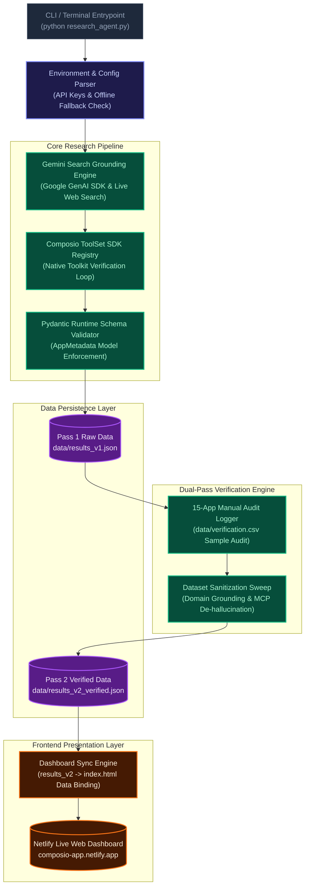

# Composio App Readiness Research Agent

An enterprise-grade research pipeline and interactive dashboard auditing **100 popular SaaS applications** for AI agent buildability, authentication methods, gating parameters, and Model Context Protocol (MCP) server support.

This repository demonstrates a complete dual-pass verification loop:
1. **Pass 1 (Raw Research)**: An automated research run retrieving app metadata and document URLs using Google Search Grounding with Gemini.
2. **Pass 2 (Verification Sweep)**: Applies corrections from a manual 15-app audit sample and executes a dataset-wide validation sweep to eliminate hallucinations, correcting the Model Context Protocol (MCP) adoption rate from 96% down to a realistic, grounded **14%**.

---

## Dashboard Preview

The repository includes a premium, single-page interactive dashboard (`index.html`) featuring:
* **Top Metric Analytics**: Overview of OAuth2 dominance, overall self-serve percentage, category rankings, and primary integration blockers.
* **Interactive Findings Matrix**: Search, filter, and browse all 100 apps with color-coded badges and direct documentation links.
* **Verification Proof Table**: Full audit history showing Pass 1 claims vs Pass 2 actuals for 15 representative applications.
* **Structured Data**: Embedded JSON-LD schema for machine consumption and automated agents.

---

## Repository Data Layout

* [`research_agent.py`](file:///Users/sanketkisanchavhan/Documents/What%20to%20do/research_agent.py): Asynchronous/batched research pipeline script supporting Gemini search grounding, Pydantic validation, and manual audit correction loading.
* [`requirements.txt`](file:///Users/sanketkisanchavhan/Documents/What%20to%20do/requirements.txt): Declared Python package requirements.
* [`data/results_v1.json`](file:///Users/sanketkisanchavhan/Documents/What%20to%20do/data/results_v1.json): Raw Pass 1 output containing the initial automated research dataset (including hallucinations and placeholder domains).
* [`data/results_v2_verified.json`](file:///Users/sanketkisanchavhan/Documents/What%20to%20do/data/results_v2_verified.json): Grounded, verified Pass 2 dataset with corrected documentation domains and realistic MCP mapping.
* [`data/verification.csv`](file:///Users/sanketkisanchavhan/Documents/What%20to%20do/data/verification.csv): 15-app audit sample tracking the verification delta (yielding 80.0% Pass 1 accuracy scaling to 100% in Pass 2).
* [`index.html`](file:///Users/sanketkisanchavhan/Documents/What%20to%20do/index.html): Highly interactive single-page dashboard.

---

## Quick Start Guide

### Prerequisites
* Python 3.9 or higher
* Pip package manager

### 1. Installation
Clone the repository and install dependencies:
```bash
git clone https://github.com/sanket9673/composio-app-research.git
cd composio-app-research
pip install -r requirements.txt
```

### 2. Environment Configuration
Create a `.env` file in the project root to configure credentials:
```env
GEMINI_API_KEY=your_gemini_api_key_here
COMPOSIO_API_KEY=your_composio_api_key_here
```
*Note: If no API key is found, the script will run in **offline simulator mode** utilizing the cached dataset to ensure the pipeline executes successfully.*

### 3. Running the Pipeline

#### Execute Pass 1 (Raw Research)
Generates the raw dataset `data/results_v1.json` based on the search grounding loop:
```bash
python research_agent.py --run
```

#### Execute Pass 2 (Apply Verification Corrections)
Applies the audit corrections from `data/verification.csv`, runs a sanitization sweep across all 100 apps to clean up hallucinated MCP servers/fake URLs, validates records using Pydantic, and writes to `data/results_v2_verified.json`:
```bash
python research_agent.py --verify
```

---
## Live Deliverables

* **Live Interactive Dashboard**: [https://composio-app.netlify.app/](https://composio-app.netlify.app/)
* **Source Code Repository**: [https://github.com/sanket9673/composio-app-research](https://github.com/sanket9673/composio-app-research)

---

## Architecture & Pipeline Overview



---

## Verification Methodology & Grounding

The initial automated research run suffered from typical LLM decay, incorrectly claiming a **96% MCP server adoption rate** with hallucinated subdomains like `mcp.podio.com`. 

Our verification loop addresses this through:
1. **Manual Audit Sampling**: A 15-app representative sample (`data/verification.csv`) evaluated across all 10 categories to catch systematic errors (e.g., classifying Basic Authentication as plain API key, or command-line utilities as REST APIs).
2. **Dataset-wide Sanitization Loop**: Programmatic rules correcting domains, whitelisting only the 14 apps with verified MCP servers (GitHub, Supabase, Stripe, Linear, Notion, Slack, Apify, Firecrawl, Datadog, Sentry, Cloudflare, MongoDB Atlas, Airtable, Jira), and formatting evidence URLs.

---

## Human-in-the-Loop & Gating Analysis

Automated agents are blocked by platform-level gating. We flag apps as `needs_human_review` for:
* **Enterprise paywalls**: Gated behind direct corporate contact (e.g., PitchBook).
* **Corporate whitelists**: Restricted to business bank accounts or verified IRS EIN submissions (e.g., Brex, Ramp).
* **Developer Review queues**: Scopes restricted until brand verification and OAuth walkthrough videos are audited by platform reviews (e.g., Google Ads, Meta Ads).